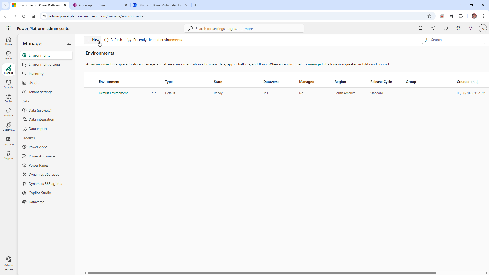
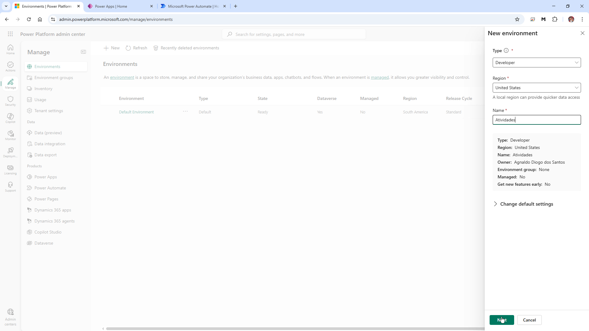
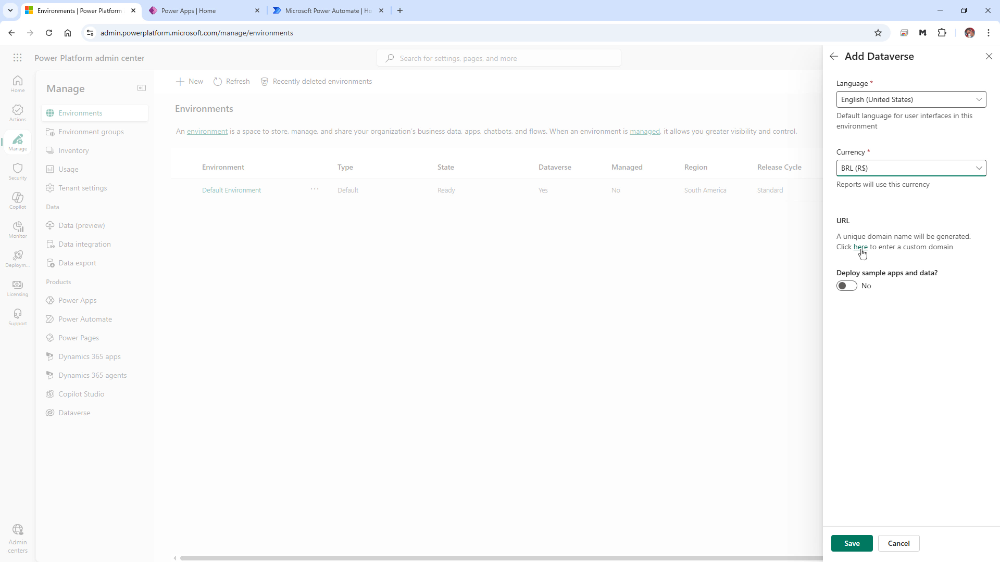
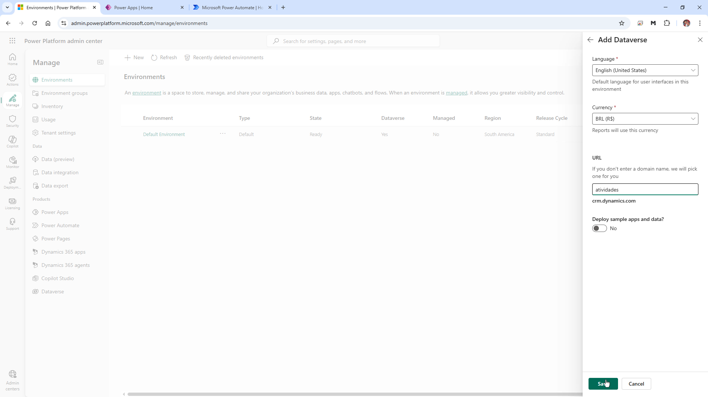
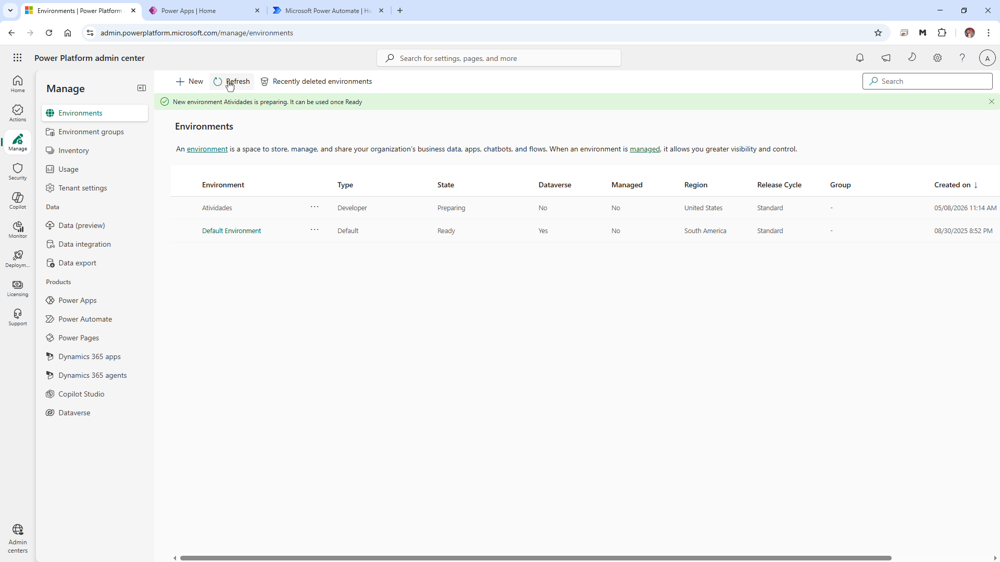
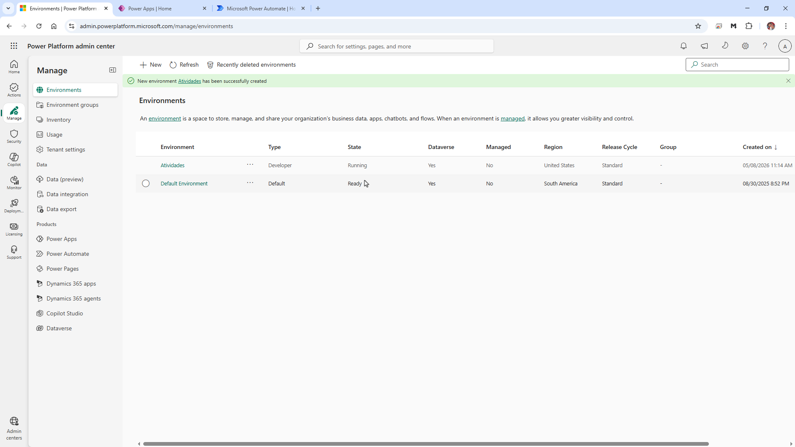

# Atividade 001: Criar ambiente Developer no Power Platform com Dataverse (5 minutos)

## Objetivo

Criar um novo ambiente do tipo **Developer** no Power Platform Admin Center, com **Dataverse** habilitado e configurando idioma, moeda e URL personalizada.

---

## Passo a passo

## Passo 1 — Acessar o Power Platform Admin Center

1. Abra o navegador.
2. Acesse:
   ```text
   https://admin.powerplatform.microsoft.com
   ```
3. No menu lateral esquerdo, clique em:

   ```text
   Environments
   ```

4. Clique em:

   ```text
   New
   ```



---

## Passo 2 — Definir as propriedades do ambiente

Na lateral direita será exibido o painel **New environment**.

Configure os campos:

| Campo | Valor |
|---|---|
| Type | Developer |
| Region | United States |
| Name | Atividades |

Após preencher os campos, clique em:

```text
Next
```



---

## Passo 3 — Configurar o Dataverse

Na tela **Add Dataverse**, configure:

| Campo | Valor |
|---|---|
| Language | English (United States) |
| Currency | BRL (R$) |



---

## Passo 4 — Definir URL personalizada

1. Na seção **URL**, clique em:

   ```text
   here
   ```

2. Informe o identificador desejado para o ambiente.

Exemplo utilizado:

```text
atividades
```

A URL final será semelhante a:

```text
atividades.crm.dynamics.com
```



---

## Passo 5 — Salvar a configuração

1. Verifique as configurações.
2. Confirme que a opção abaixo está desabilitada:

   ```text
   Deploy sample apps and data? = No
   ```

3. Clique em:

   ```text
   Save
   ```



---

## Passo 6 — Acompanhar a criação do ambiente

Após salvar:

1. O ambiente será criado.
2. Inicialmente o status ficará como:

   ```text
   Preparing
   ```

3. Aguarde até o status mudar para:

   ```text
   Running
   ```

4. Observe também que o Dataverse estará habilitado.



---

## Resultado esperado

Ao final do procedimento deverá existir:

- um ambiente do tipo:
  ```text
  Developer
  ```
- Dataverse habilitado
- região configurada como:
  ```text
  United States
  ```
- idioma:
  ```text
  English (United States)
  ```
- moeda:
  ```text
  BRL (R$)
  ```
- URL personalizada configurada
- status final:
  ```text
  Running
  ```

O ambiente estará pronto para utilização em:
- Power Apps
- Power Automate
- Dataverse
- Copilot Studio
- Soluções e automações do Power Platform

## Vídeo

<video controls width="100%">
    <source src="Files001/001-CriarEnvironment.mp4" type="video/mp4">
</video>