# Passo a passo — Criação de ambiente no Power Platform Admin Center

## Objetivo

Criar um novo ambiente do tipo **Developer** no **Power Platform admin center**, configurar a região, adicionar o **Dataverse**, definir idioma/moeda/URL e validar o acesso ao ambiente pelo Power Apps.

## Pré-requisitos

- Acesso ao **Power Platform admin center**.
- Permissão administrativa para criar ambientes.
- Conta autenticada no tenant Microsoft 365/Power Platform.
- Licenciamento ou direito de uso compatível com ambiente Developer.

---

## 1. Acessar o Power Platform Admin Center

1. Abra o navegador.
2. Acesse o endereço:

   `https://admin.powerplatform.microsoft.com`

3. No menu lateral esquerdo, acesse **Manage**.
4. Clique em **Environments**.
5. Aguarde a listagem de ambientes carregar.

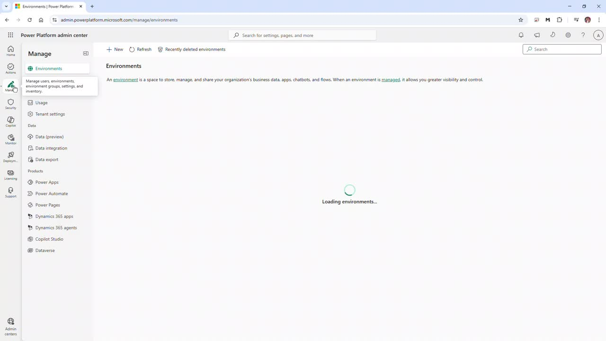

---

## 2. Iniciar a criação de um novo ambiente

1. Na tela **Environments**, clique em **+ New**.
2. Será aberto o painel lateral **New environment**.

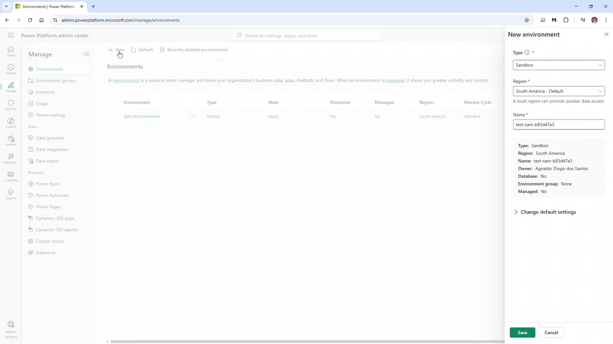

---

## 3. Definir o tipo e a região do ambiente

No painel **New environment**, configure:

1. Em **Type**, selecione **Developer**.
2. Em **Region**, selecione **United States**.

> No vídeo, inicialmente aparece um ambiente de teste/sandbox, mas a configuração final utilizada para o exemplo é **Developer** com região **United States**.

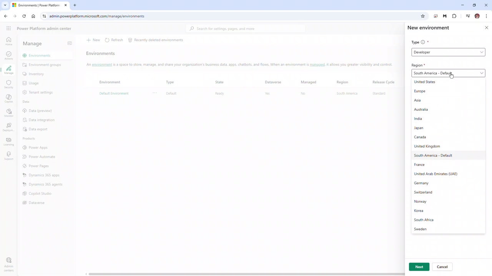

---

## 4. Informar o nome do ambiente

1. No campo **Name**, digite o nome do ambiente.
2. No vídeo, foi usado o nome:

   `ka`

3. Confira o resumo exibido no painel lateral:
   - **Type:** Developer
   - **Region:** United States
   - **Name:** ka
   - **Environment group:** None
   - **Managed:** No
   - **Get new features early:** No

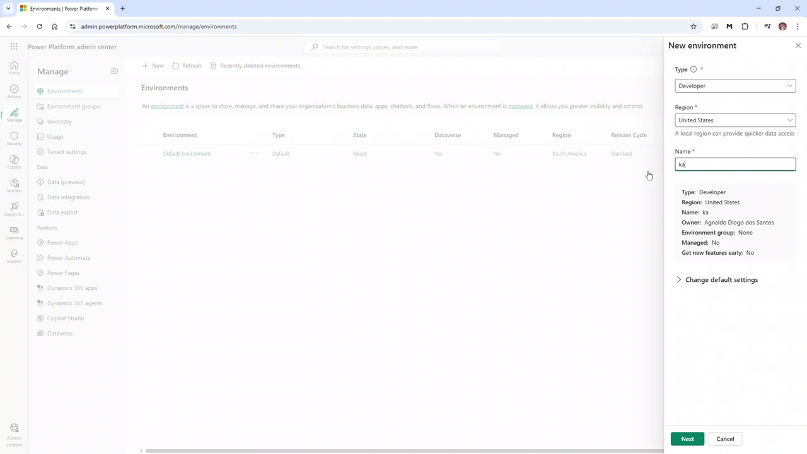

---

## 5. Ajustar as configurações padrão

1. Expanda a seção **Change default settings**.
2. Mantenha ou revise as opções exibidas:
   - **Environment group:** sem grupo selecionado, se não houver necessidade.
   - **Make this a Managed Environment:** **No**.
   - **Get new features early:** **No**.
3. Clique em **Next**.

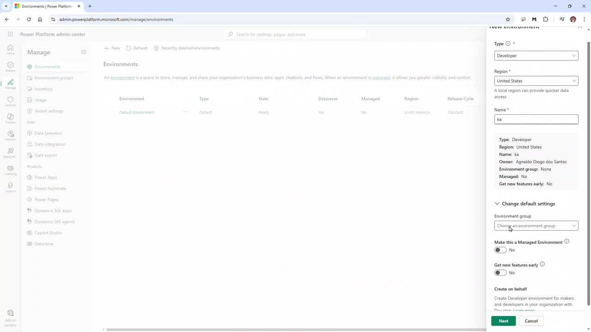

---

## 6. Configurar o Dataverse

Na tela **Add Dataverse**, configure os campos principais:

1. Em **Language**, selecione:

   `English (United States)`

2. Em **Currency**, selecione:

   `BRL (R$)`

3. Em **URL**, defina o nome da URL do ambiente.

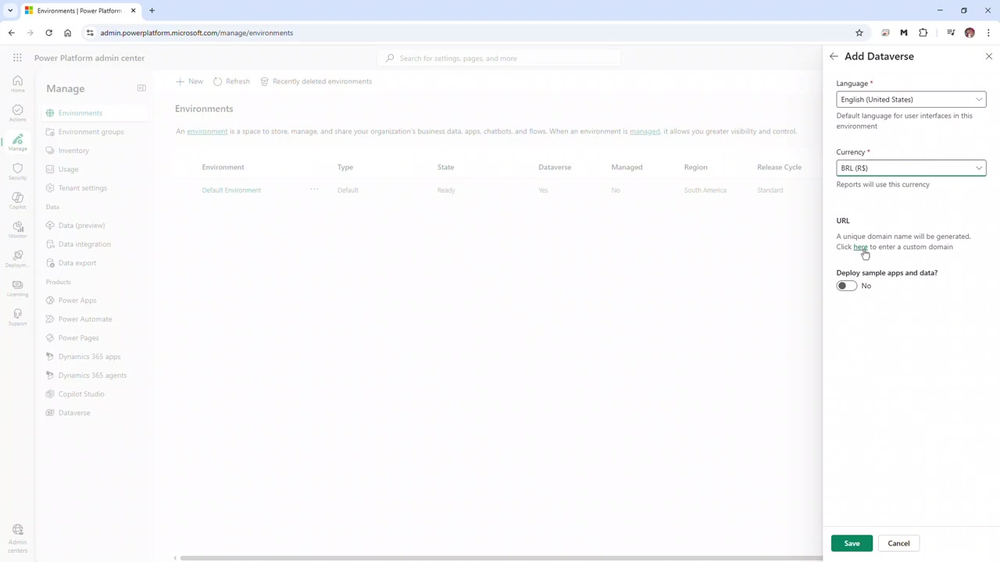

---

## 7. Definir a URL do ambiente

1. No campo **URL**, informe o identificador desejado.
2. No vídeo, foi usado:

   `kademos`

3. O endereço final será criado no domínio:

   `crm.dynamics.com`

4. Mantenha **Deploy sample apps and data?** como **No**, caso não queira instalar dados e aplicativos de exemplo.
5. Clique em **Save**.

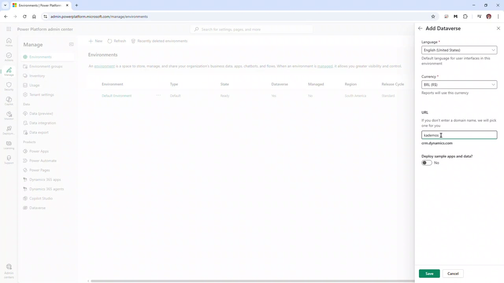

---

## 8. Aguardar a criação do ambiente

1. Após clicar em **Save**, aguarde o processamento.
2. O painel exibirá a mensagem de carregamento enquanto o ambiente é salvo.

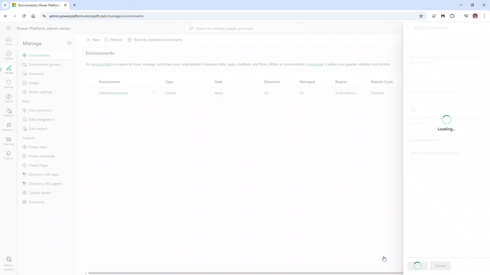

---

## 9. Confirmar que o ambiente está sendo preparado

1. Após o salvamento, o novo ambiente aparecerá na lista.
2. O ambiente será exibido com o estado **Preparing**.
3. Uma mensagem superior informa que o novo ambiente está sendo preparado e poderá ser usado quando estiver **Ready**.

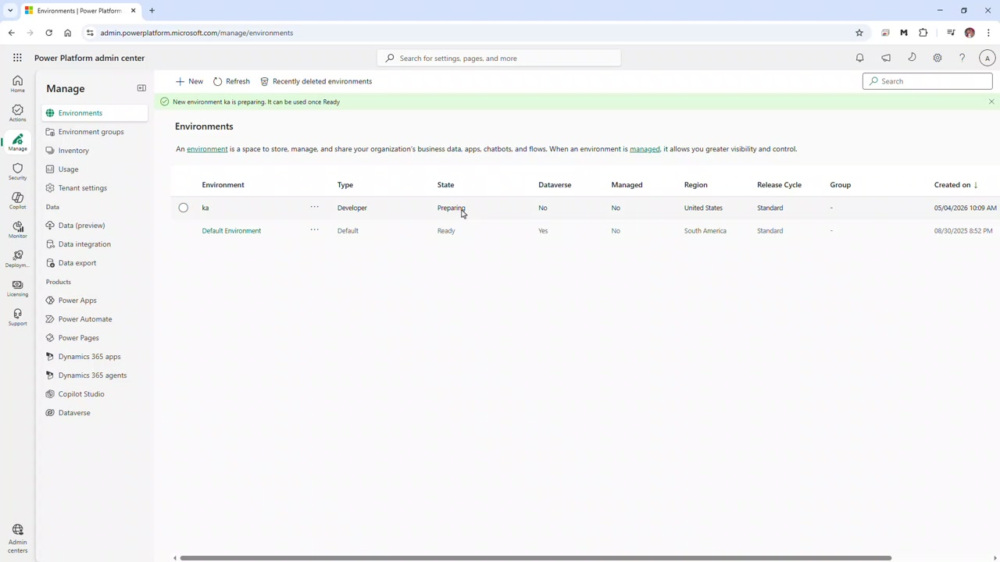

---

## 10. Validar o ambiente na lista

Na listagem de ambientes, confira as informações principais:

- **Environment:** ka
- **Type:** Developer
- **State:** Preparing
- **Dataverse:** No durante a preparação inicial
- **Managed:** No
- **Region:** United States
- **Release Cycle:** Standard

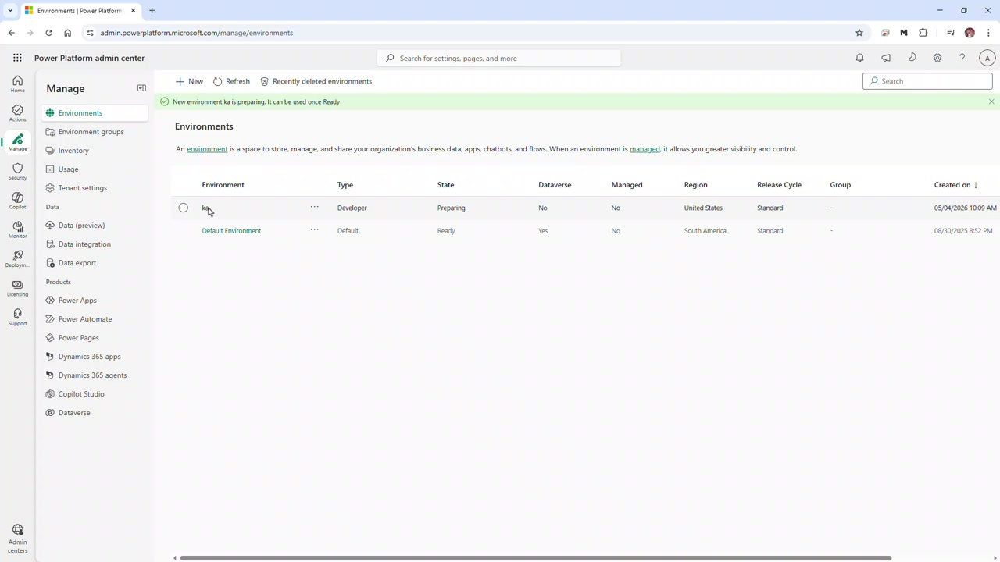

> Aguarde alguns minutos e use **Refresh** até o ambiente ficar disponível. Dependendo do tenant e da região, a criação pode levar mais tempo.

---

## 11. Acessar o ambiente pelo Power Apps

1. Após a criação do ambiente, acesse o Power Apps no endereço do ambiente.
2. No vídeo, o endereço acessado foi semelhante a:

   `https://kademos.crm.dynamics.com`

3. A tela exibirá os aplicativos publicados do ambiente, como:
   - **Power Pages Management**
   - **Power Platform Environment Settings**
   - **Solution Health Hub**
4. Também será possível iniciar a criação de um aplicativo pela opção **Create new App** / **App Designer**.

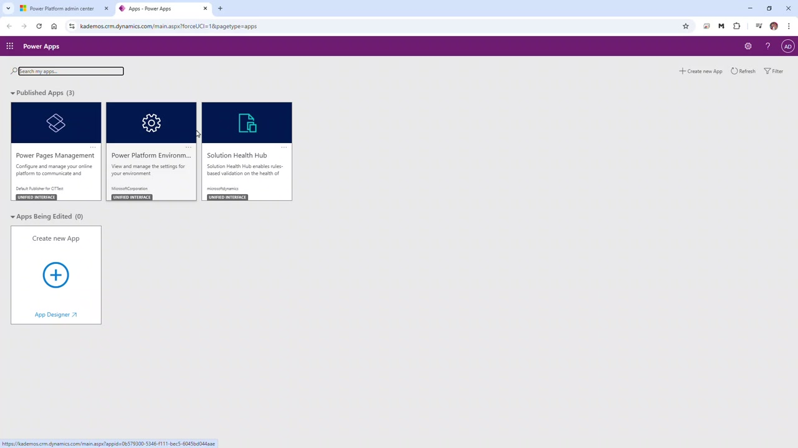

---

## Resultado esperado

Ao final do procedimento, o ambiente **Developer** estará criado no Power Platform, com Dataverse configurado, moeda **BRL (R$)**, idioma **English (United States)** e URL personalizada para acesso ao ambiente.

## Observações importantes

- Use nomes de ambiente claros e padronizados.
- A URL precisa ser única dentro do domínio disponível.
- Para laboratórios e treinamentos, ambiente **Developer** é adequado para demonstrações e testes.
- Para ambientes corporativos, avalie políticas de governança, grupos de ambiente, DLP, segurança e gerenciamento antes de liberar o uso.
