# Passo a passo — Criar uma Solution no Power Apps

## Objetivo

Criar uma **Solution** no Power Apps, definir um **Publisher** personalizado e confirmar a criação da solução no ambiente selecionado.

---

## 1. Acessar o Power Apps

1. Abra o navegador.
2. Acesse o portal do Power Apps.
3. Confirme que você está conectado com a conta correta.
4. Verifique, no canto superior direito, o ambiente ativo.

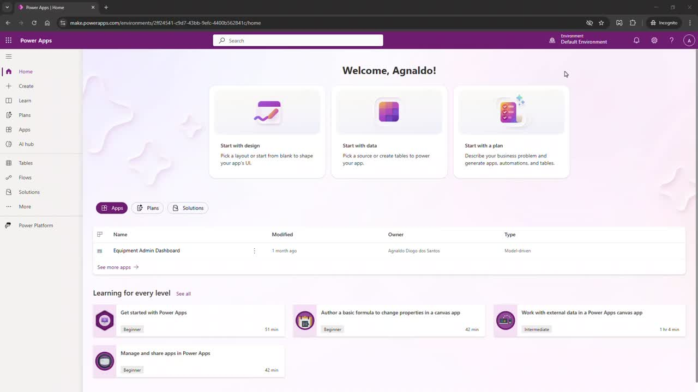

---

## 2. Conferir o ambiente ativo

1. No canto superior direito, observe o nome do ambiente selecionado.
2. No vídeo, o ambiente exibido é **ka**.
3. Caso esteja em outro ambiente, troque para o ambiente correto antes de continuar.

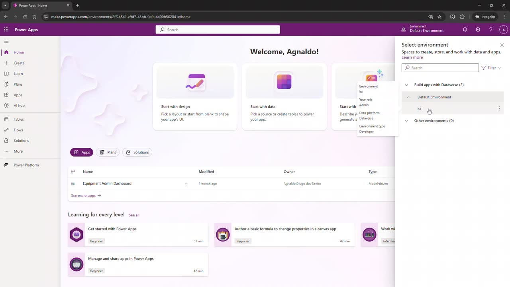

---

## 3. Abrir a área de Solutions

1. No menu lateral esquerdo, clique em **Solutions**.
2. A página de soluções será aberta.
3. Aguarde o carregamento da lista de soluções existentes.

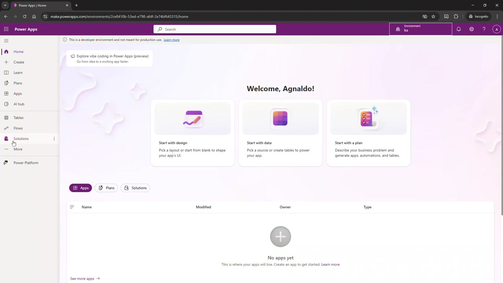

---

## 4. Iniciar a criação de uma nova Solution

1. Na barra superior da página **Solutions**, clique em **New solution**.
2. O painel lateral **New solution** será aberto à direita.

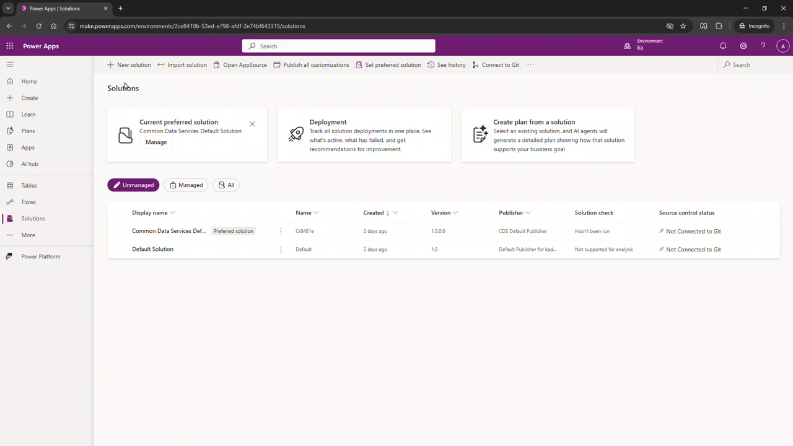

---

## 5. Preencher os dados principais da Solution

No painel **New solution**, preencha os campos básicos:

1. Em **Display name**, digite o nome de exibição da solução.
2. No vídeo, foi usado: `Caixa`.
3. O campo **Name** é preenchido automaticamente com base no nome de exibição.
4. Mantenha a versão inicial como `1.0.0.0`, salvo se houver uma política interna diferente.

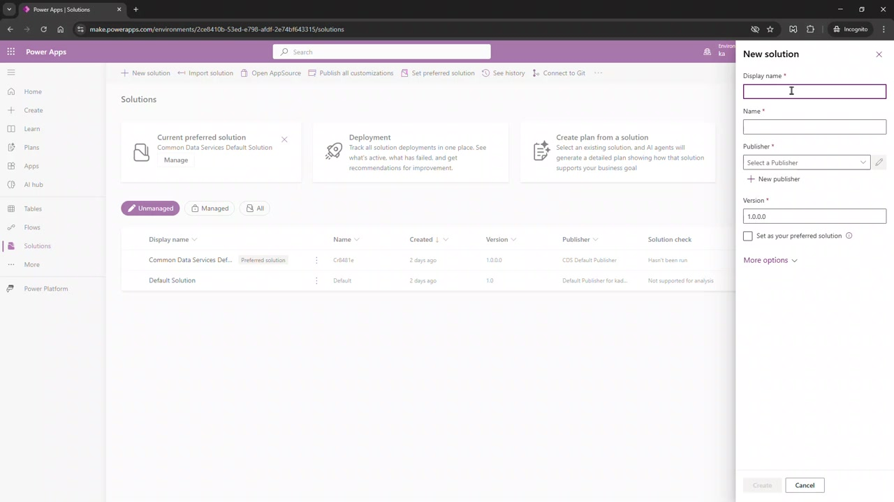

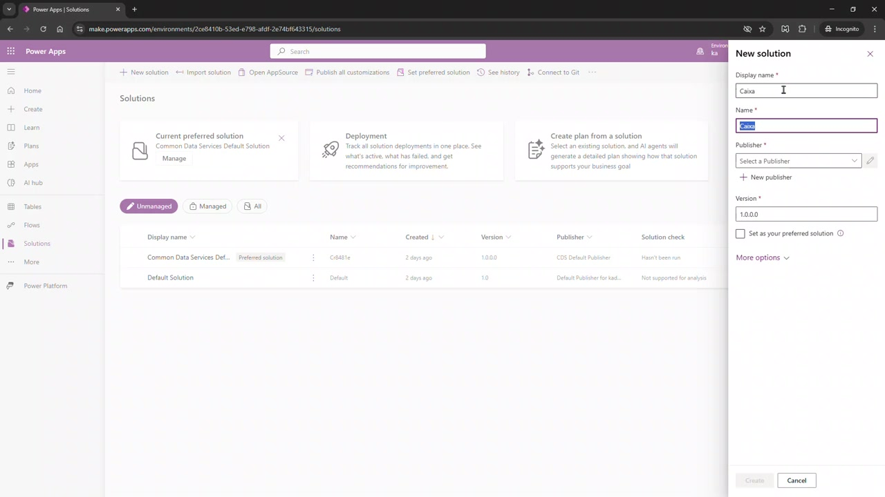

---

## 6. Criar um novo Publisher

Como ainda não há um publisher personalizado selecionado, crie um novo publisher:

1. No campo **Publisher**, clique em **New publisher**.
2. O painel lateral **New publisher** será aberto.
3. Preencha o campo **Display name**.
4. No vídeo, foi usado: `CaixaPublisher`.
5. O campo **Name** é preenchido automaticamente.

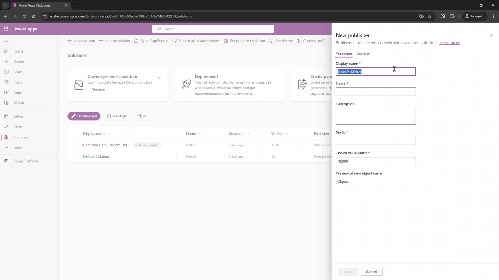

---

## 7. Definir o prefixo do Publisher

1. No campo **Prefix**, informe o prefixo que será usado nos nomes técnicos dos componentes criados dentro da solução.
2. No vídeo, foi usado: `caixa`.
3. Observe a área **Preview of new object name**. Ela mostra como os objetos serão nomeados, por exemplo: `caixa_Object`.
4. Clique em **Save** para salvar o publisher.

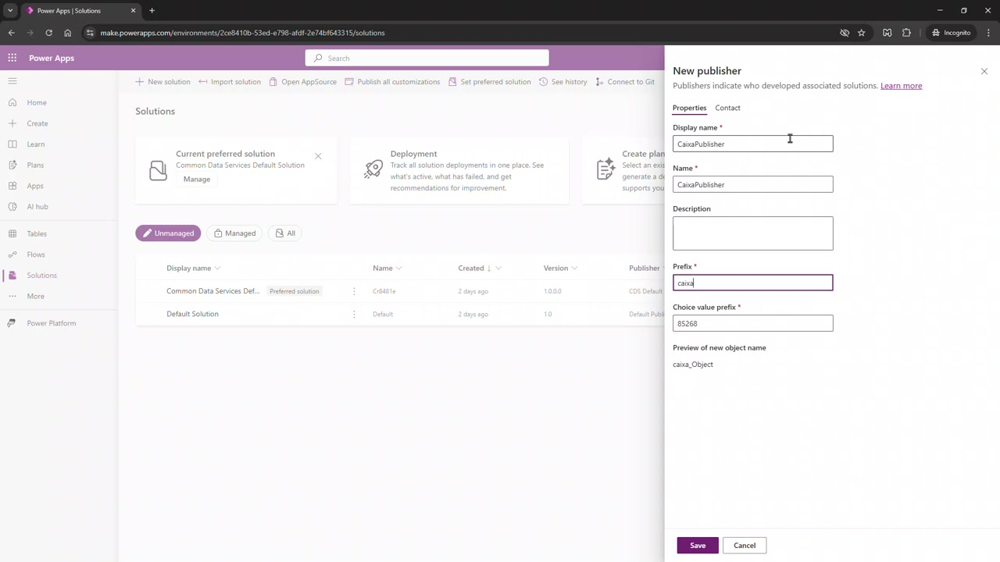

### Observação importante

O **Prefix** é relevante porque passa a identificar os componentes personalizados criados dentro da solução. Em ambientes reais, use um prefixo curto, padronizado e ligado à empresa, área ou projeto.

---

## 8. Concluir a criação da Solution

Depois de salvar o publisher:

1. Volte ao painel **New solution**.
2. Confirme os campos:
   - **Display name**: `Caixa`
   - **Name**: `Caixa`
   - **Publisher**: `CaixaPublisher`
   - **Version**: `1.0.0.0`
3. Clique em **Create**.

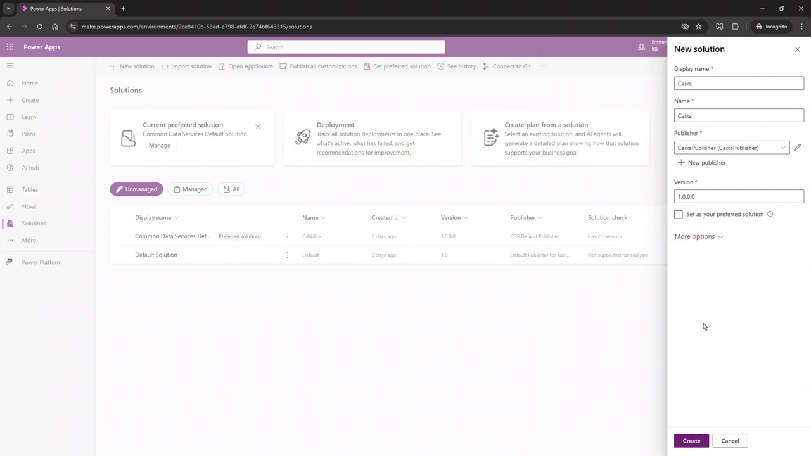

---

## 9. Verificar a Solution criada

Após a criação, o Power Apps abre a solução criada.

1. Na lateral esquerda, confira o nome da solução: **Caixa**.
2. A guia **Objects** aparece selecionada.
3. Como a solução acabou de ser criada, ela ainda não possui componentes.
4. A tela exibe a mensagem indicando que não há itens para mostrar.

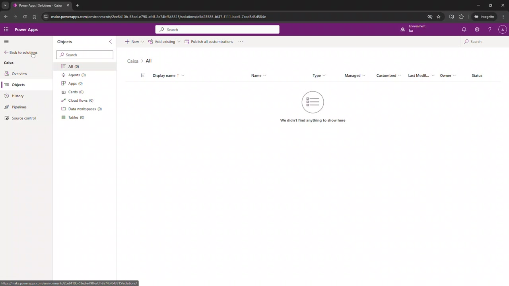

---

## 10. Voltar para a lista de Solutions

1. Clique em **Back to solutions**.
2. A lista de soluções será exibida novamente.
3. A solução **Caixa** aparecerá na lista.
4. Ela também aparece como **Current preferred solution**.
5. Na coluna **Publisher**, confirme o publisher **CaixaPublisher**.

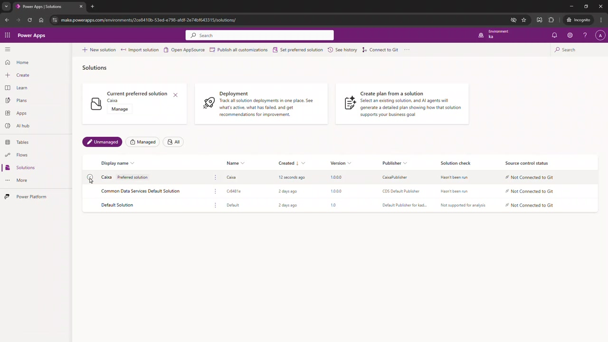

---

## Resultado esperado

Ao final do procedimento, você terá:

- Uma solution chamada **Caixa**.
- Um publisher personalizado chamado **CaixaPublisher**.
- Um prefixo técnico definido como **caixa**.
- A solução configurada como solução preferencial do ambiente.
- Uma solution vazia, pronta para receber tabelas, aplicativos, fluxos, agentes e demais componentes do projeto.

---

## Boas práticas

- Crie componentes sempre dentro de uma **Solution**, e não diretamente fora dela.
- Use um **Publisher** próprio, em vez do publisher padrão.
- Defina um prefixo técnico curto e consistente.
- Evite alterar nomes técnicos depois que os componentes forem criados.
- Use nomes claros para soluções, especialmente em ambientes de treinamento, homologação e produção.

---

## Próximo passo sugerido

Depois de criar a solution, o próximo passo natural é adicionar componentes, como:

- Tabelas do Dataverse.
- Aplicativos canvas.
- Aplicativos model-driven.
- Cloud flows do Power Automate.
- Agentes do Copilot Studio.
