# Passo a passo — Criar um site de comunicação no SharePoint

Este guia descreve o procedimento demonstrado no vídeo para criar um novo site no SharePoint, escolhendo o tipo de site, aplicando um modelo, definindo nome, endereço, idioma e finalizando a criação do site.

## Objetivo

Criar um novo site de comunicação no SharePoint chamado **Caixa**, usando o modelo **Standard communication**.

## Pré-requisitos

- Acesso ao SharePoint Online.
- Permissão para criar sites no tenant Microsoft 365.
- Navegador autenticado com uma conta corporativa ou educacional.

---

## 1. Acessar a página inicial do SharePoint

1. Abra o SharePoint no navegador.
2. Confirme que está na página inicial do SharePoint.
3. No topo da tela, localize a opção **Create site**.

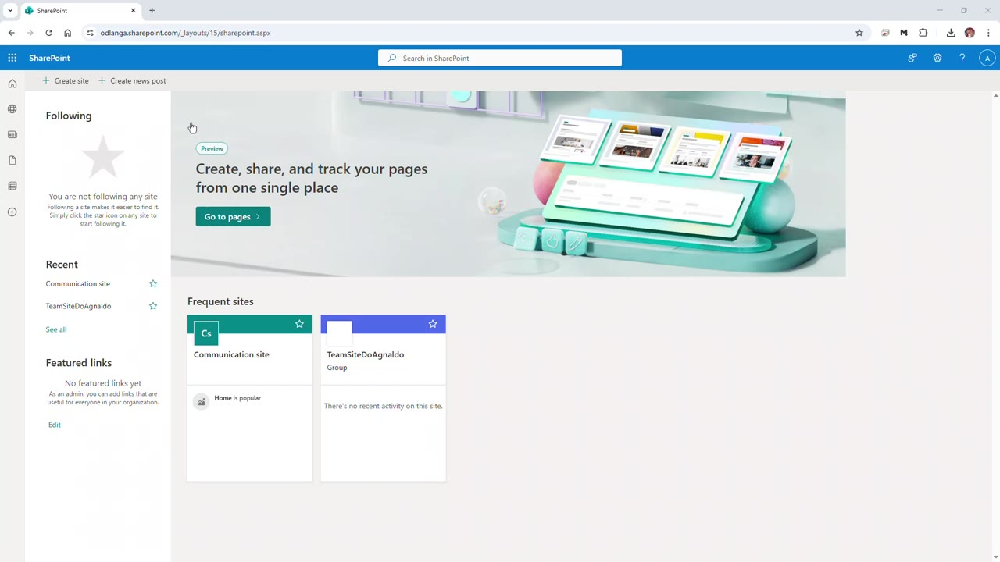

---

## 2. Iniciar a criação de um novo site

1. Clique em **Create site**.
2. O SharePoint exibirá a janela **Create a site: Select the site type**.
3. Escolha o tipo de site que será criado.

Nesta demonstração, o tipo escolhido é **Communication site**.

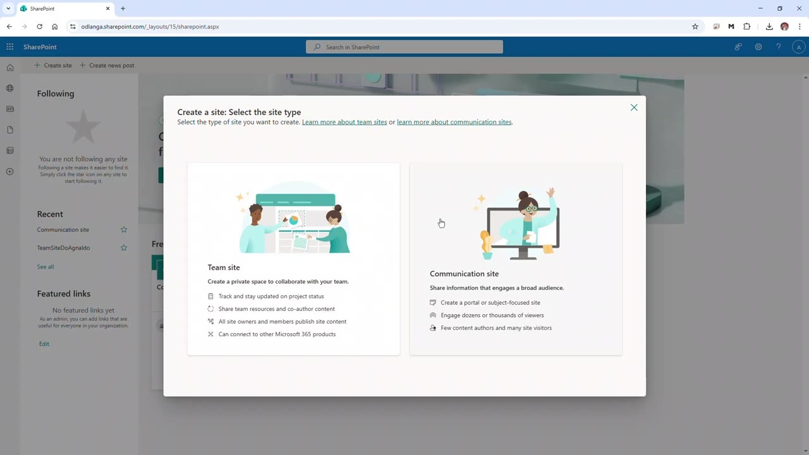

### Diferença prática entre os tipos

- **Team site**: indicado para colaboração entre membros de uma equipe, com edição e contribuição frequente de vários usuários.
- **Communication site**: indicado para divulgação de informações, páginas institucionais, comunicados, notícias e conteúdo para um público maior.

Como o vídeo demonstra a criação de um site voltado à comunicação, a escolha correta é **Communication site**.

---

## 3. Selecionar um modelo de site

1. Após escolher **Communication site**, a tela **Select a template** será exibida.
2. Na guia **From Microsoft**, selecione o modelo desejado.
3. No vídeo, o modelo escolhido é **Standard communication**.

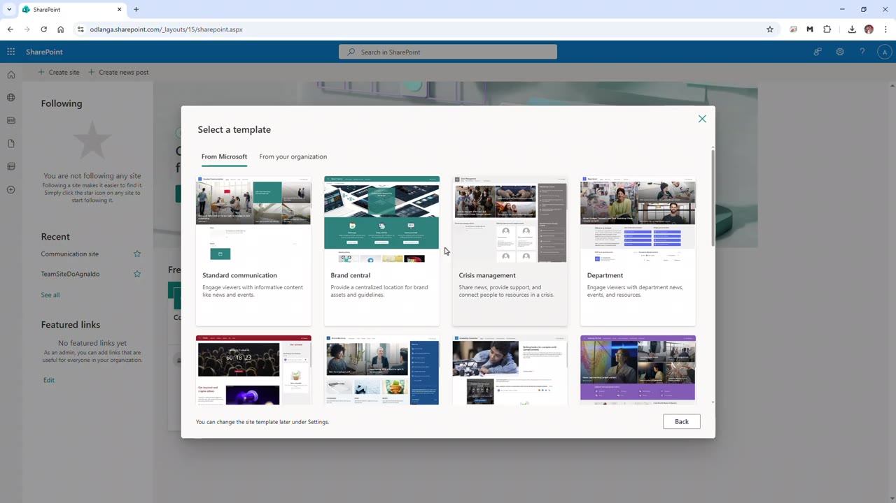

---

## 4. Visualizar o modelo selecionado

1. Depois de selecionar o modelo **Standard communication**, o SharePoint mostra uma prévia do modelo.
2. Revise as informações exibidas em **Site capabilities**.
3. Verifique também a seção **What's included**.
4. Clique em **Use template** para continuar.

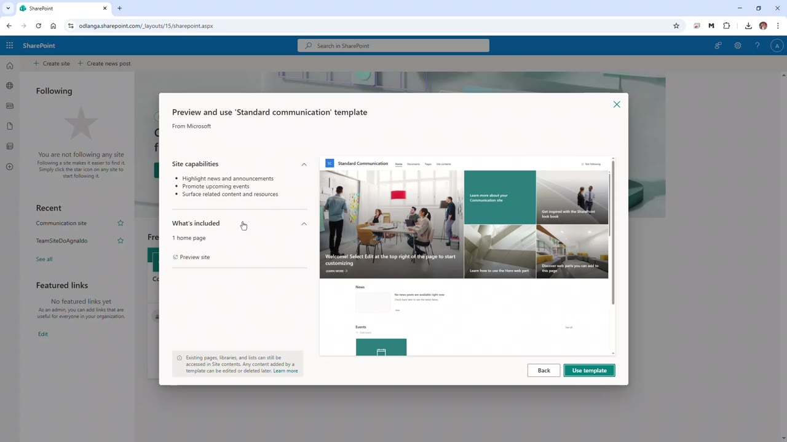

O modelo **Standard communication** inclui uma página inicial pronta, com estrutura visual e web parts básicas para publicação de conteúdo.

---

## 5. Informar o nome do site

1. Na tela **Give your site a name**, clique no campo **Site name**.
2. Digite o nome desejado para o site.
3. No exemplo do vídeo, o nome informado é:

```text
Caixa
```

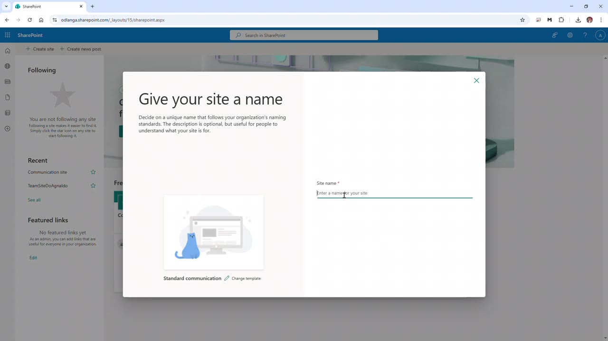

---

## 6. Validar o nome e o endereço do site

1. Após digitar o nome, o SharePoint verifica se ele está disponível.
2. O sistema exibe a mensagem **The site name is available** quando o nome pode ser usado.
3. O campo **Site address** é preenchido automaticamente com base no nome do site.
4. No vídeo, o endereço gerado é semelhante a:

```text
/sites/Caixa
```

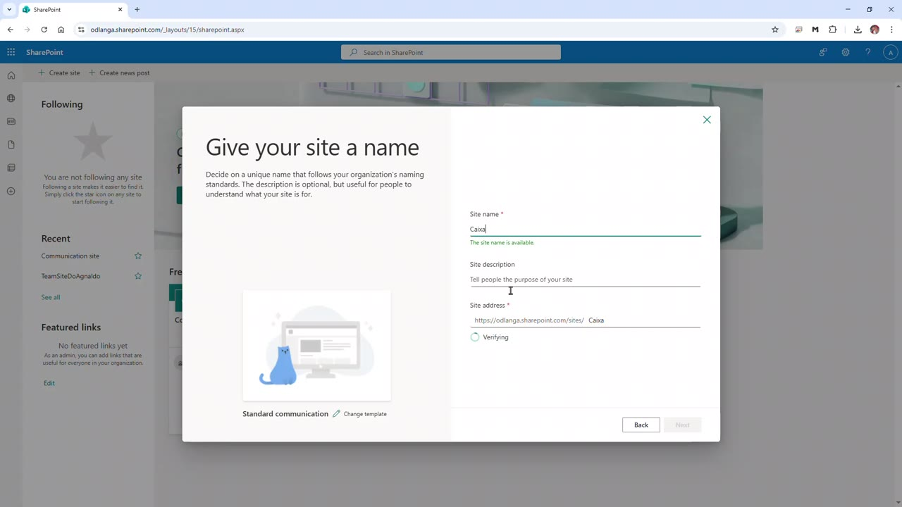

---

## 7. Confirmar o endereço do site

1. Aguarde a validação do endereço.
2. Confirme se aparece a mensagem **The site address is available**.
3. Clique em **Next** para avançar.

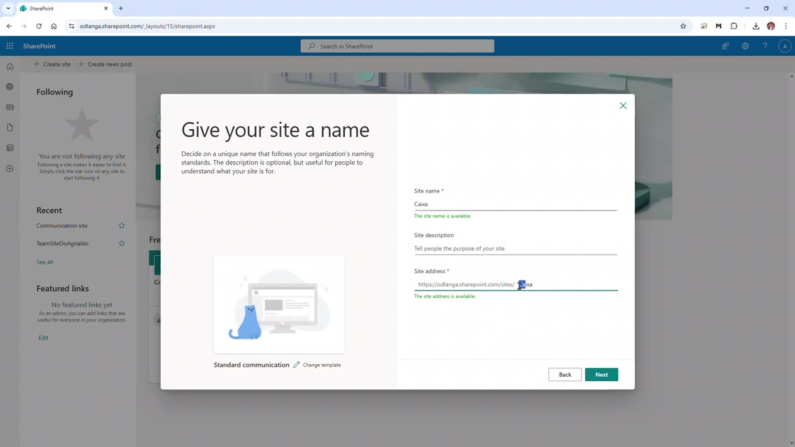

> Observação: o endereço do site deve ser definido com cuidado, pois ele compõe a URL final do site no SharePoint.

---

## 8. Configurar idioma e opções adicionais

1. Na tela **Set language and other options**, confirme o idioma padrão do site.
2. No vídeo, o idioma selecionado é **English**.
3. Caso necessário, abra a lista de idiomas e selecione outro idioma.
4. Após confirmar o idioma, clique em **Create site**.

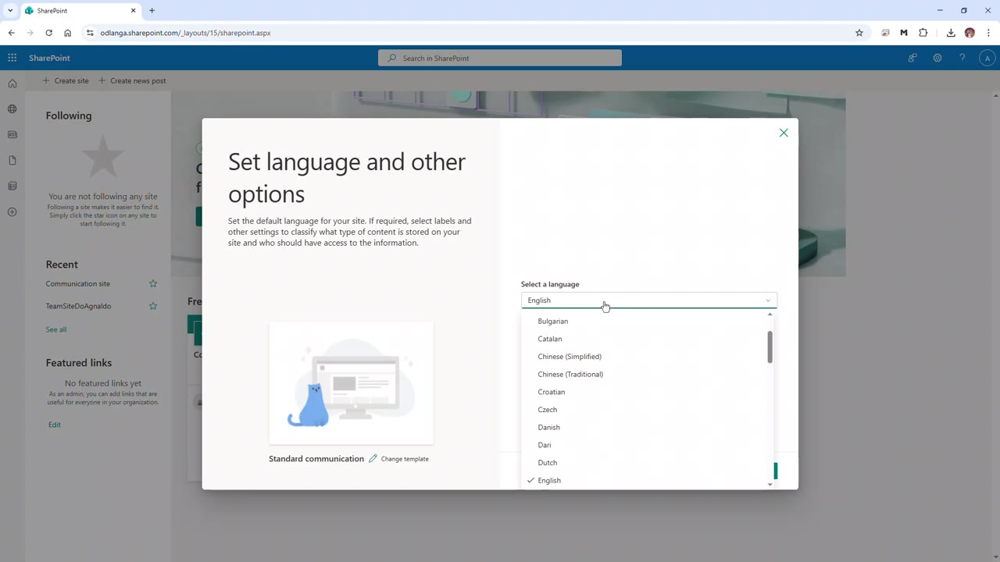

> Atenção: o idioma padrão do site deve ser escolhido corretamente, pois essa configuração pode impactar menus, rótulos e elementos padrão do site.

---

## 9. Aguardar a criação do site

1. Após clicar em **Create site**, o SharePoint inicia o provisionamento.
2. A mensagem **Creating site** será exibida na parte inferior da janela.
3. Aguarde até que o processo seja concluído.

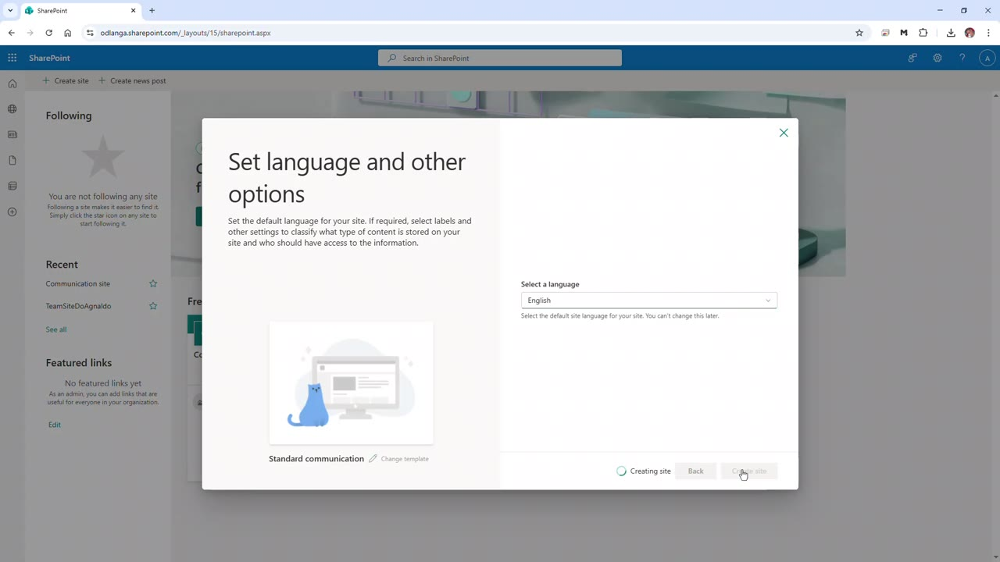

---

## 10. Aguardar o carregamento do novo site

1. Após a criação, o SharePoint redireciona automaticamente para o novo site.
2. Aguarde o carregamento da página inicial.
3. A URL do navegador passará a exibir o caminho do novo site.

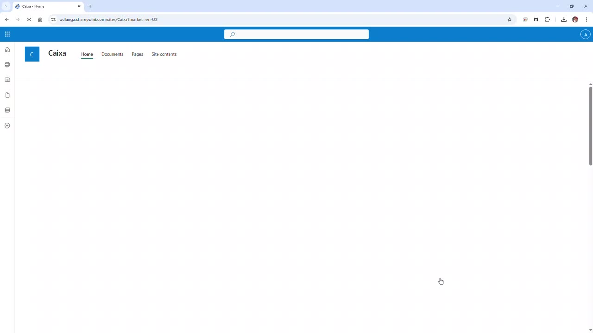

---

## 11. Confirmar que o site foi criado

1. Verifique se o nome **Caixa** aparece no cabeçalho do site.
2. Confirme se a página inicial do modelo foi carregada.
3. O menu superior apresenta opções como:
   - **Home**
   - **Documents**
   - **Pages**
   - **Site contents**
4. A página também apresenta opções administrativas e de edição, como:
   - **Create**
   - **Page details**
   - **Preview**
   - **Analytics**
   - **Edit**
   - **Share**
   - **Site access**

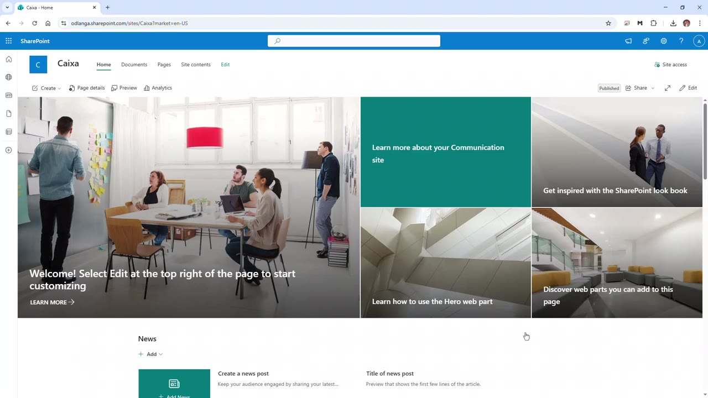

---

## Resultado final

Ao final do processo, o site de comunicação **Caixa** estará criado no SharePoint, com o modelo **Standard communication** aplicado e pronto para personalização.

