# Passo a passo — Criar a lista Produto no SharePoint

Este guia descreve o procedimento demonstrado no vídeo para criar uma lista do SharePoint chamada **Produto**, configurar colunas de cadastro e ajustar a coluna principal da lista.

## Objetivo

Criar uma lista chamada **Produto** no site **Caixa**, com as seguintes colunas:

| Coluna | Tipo | Configuração principal |
|---|---|---|
| Nome | Single line of text | Campo obrigatório |
| Unidade | Choice | Campo obrigatório, valor padrão **UN** |
| Preço | Currency | 2 casas decimais |
| Ativo | Yes/No | Valor padrão **Yes** |

## Pré-requisitos

- Acesso ao site do SharePoint **Caixa**.
- Permissão para criar listas e editar configurações de lista.
- Navegador autenticado com uma conta corporativa ou educacional.

---

## 1. Acessar o conteúdo do site

1. Abra o site **Caixa** no SharePoint.
2. No menu superior, clique em **Site contents**.
3. Confirme que a página **Site Contents** foi aberta.

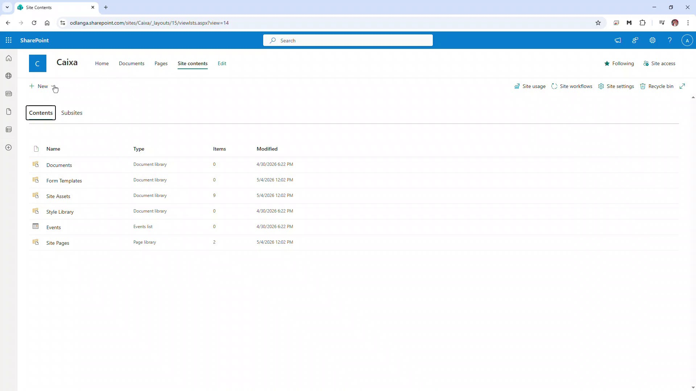

---

## 2. Iniciar a criação de uma nova lista

1. Na página **Site contents**, clique em **New**.
2. Selecione a opção **List**.
3. O SharePoint exibirá a janela **How would you like to start?**.
4. Em **Create from blank**, escolha **List**.
5. Clique em **Create**.

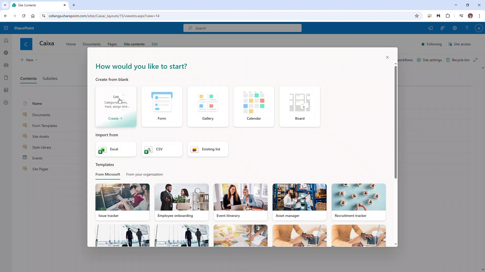

---

## 3. Informar o nome da lista

1. Na tela de criação da lista, informe o nome:

```text
Produto
```

2. Mantenha marcada a opção **Show list in site navigation**.
3. Clique em **Create**.

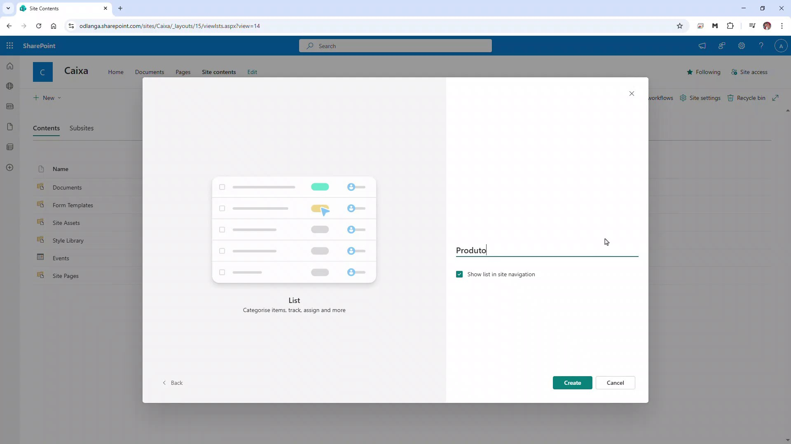

> Manter a lista na navegação do site facilita o acesso durante os exercícios e demonstrações.

---

## 4. Confirmar a criação da lista

1. Aguarde o SharePoint criar a lista.
2. Confirme que a lista **Produto** foi aberta.
3. Observe que a lista inicia com a coluna padrão **Title**.

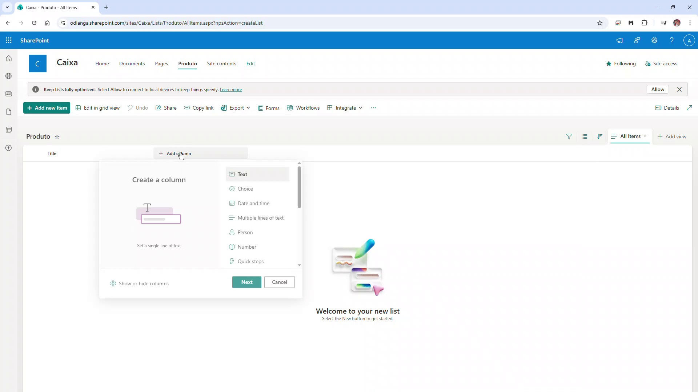

---

## 5. Criar a coluna Unidade

1. Clique em **Add column**.
2. Escolha o tipo **Choice**.
3. Clique em **Next**.
4. No painel **Create a column**, preencha o campo **Name** com:

```text
Unidade
```

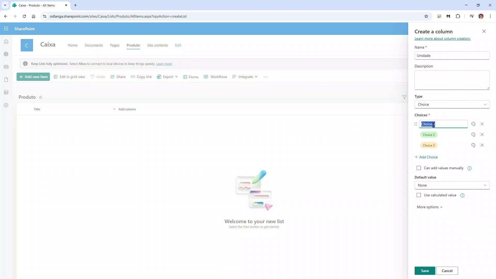

---

## 6. Configurar as opções da coluna Unidade

1. Em **Choices**, substitua as opções padrão pelos valores abaixo:

```text
UN
L
KG
M
M²
M³
```

2. Em **Default value**, selecione:

```text
UN
```

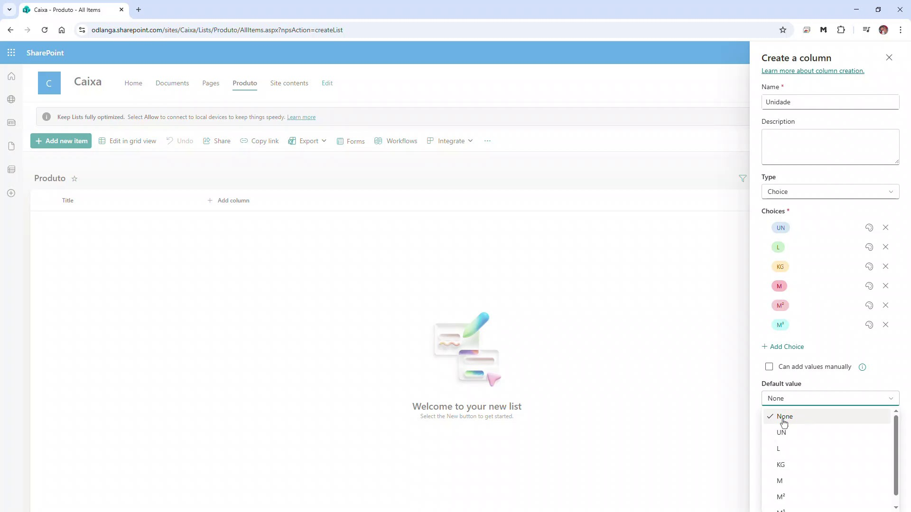

---

## 7. Ajustar opções avançadas da coluna Unidade

1. Abra **More options**.
2. Em **Display choices using**, mantenha **Drop-Down Menu**.
3. Em **Allow multiple selections**, mantenha **No**.
4. Em **Require that this column contains information**, altere para **Yes**.
5. Clique em **Save**.

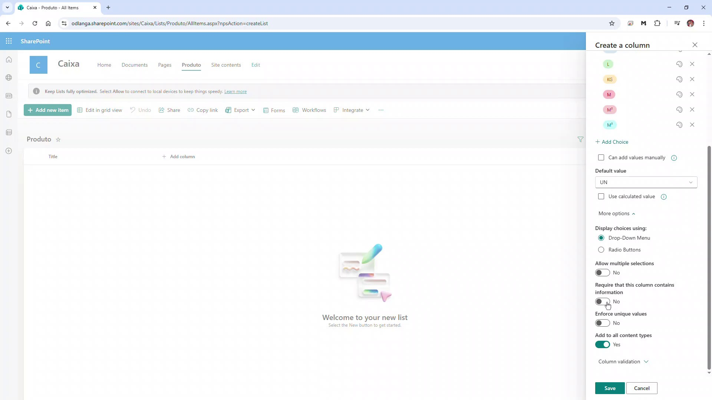

---

## 8. Criar a coluna Preço

1. Clique novamente em **Add column**.
2. Selecione inicialmente o tipo **Number**.
3. Clique em **Next**.
4. No campo **Name**, digite:

```text
Preço
```


---

## 9. Alterar o tipo da coluna Preço para Currency

1. No painel **Create a column**, abra o campo **Type**.
2. Altere o tipo para **Currency**.
3. Confirme que a tela passou a exibir as opções próprias de moeda.

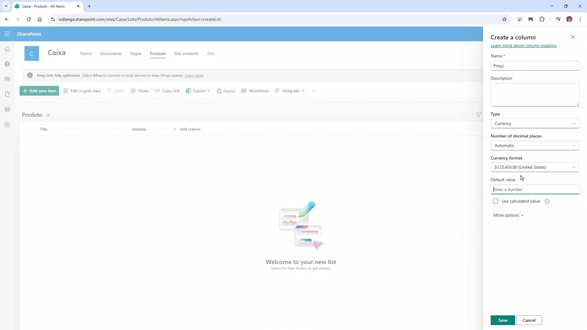

---

## 10. Configurar casas decimais da coluna Preço

1. Em **Number of decimal places**, selecione:

```text
2
```

2. Mantenha o formato de moeda exibido pelo SharePoint.
3. Abra **More options**, se necessário.
4. Clique em **Save**.

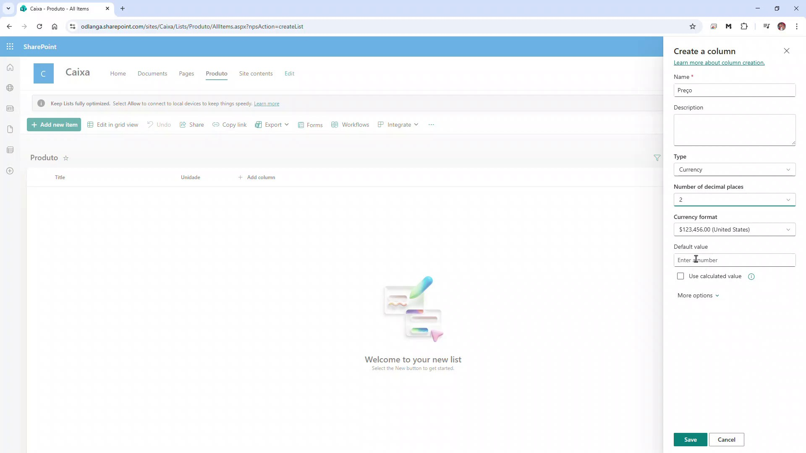

---

## 11. Criar a coluna Ativo

1. Clique em **Add column**.
2. Selecione o tipo **Yes/No**.
3. Clique em **Next**.
4. No campo **Name**, digite:

```text
Ativo
```

5. Em **Default value**, mantenha:

```text
Yes
```

6. Clique em **Save**.

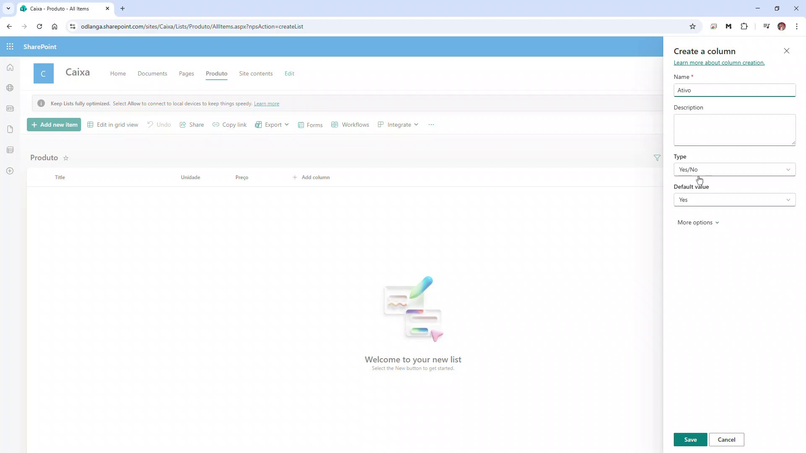

---

## 12. Confirmar as colunas criadas

1. Após salvar as colunas, confirme que a lista contém:
   - **Title**
   - **Unidade**
   - **Preço**
   - **Ativo**
2. A lista ainda está vazia, mas já possui a estrutura básica para cadastro de produtos.

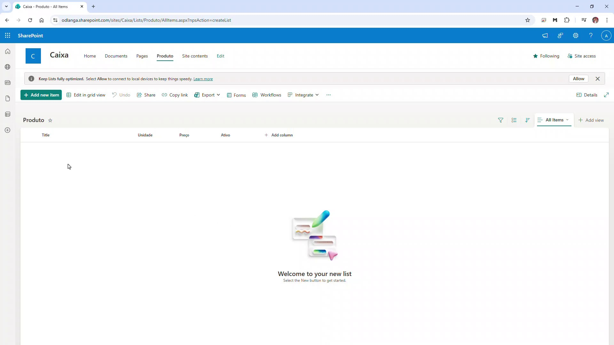

---

## 13. Voltar ao conteúdo do site

1. No menu superior, clique em **Site contents**.
2. Confirme que a lista **Produto** aparece na relação de conteúdos do site.
3. Observe que o tipo do item é **List**.

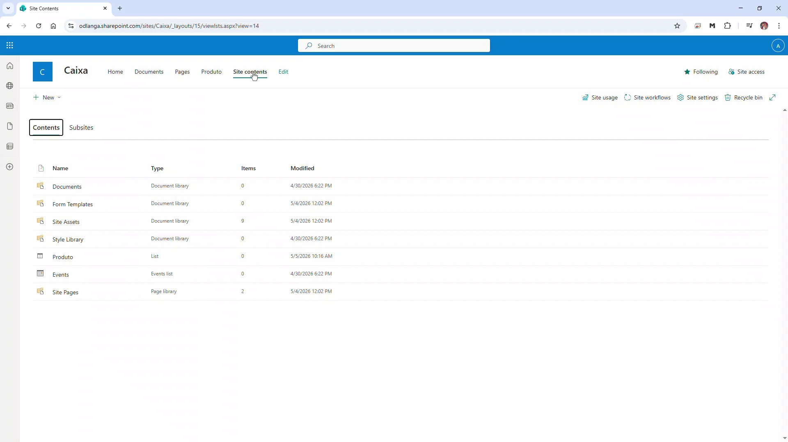

---

## 14. Abrir as configurações da lista Produto

1. Abra novamente a lista **Produto**.
2. Acesse as opções da lista e clique em **List settings**.
3. Na página **Produto - Settings**, localize a seção **Columns**.
4. Observe as colunas criadas:
   - **Title**
   - **Unidade**
   - **Preço**
   - **Ativo**

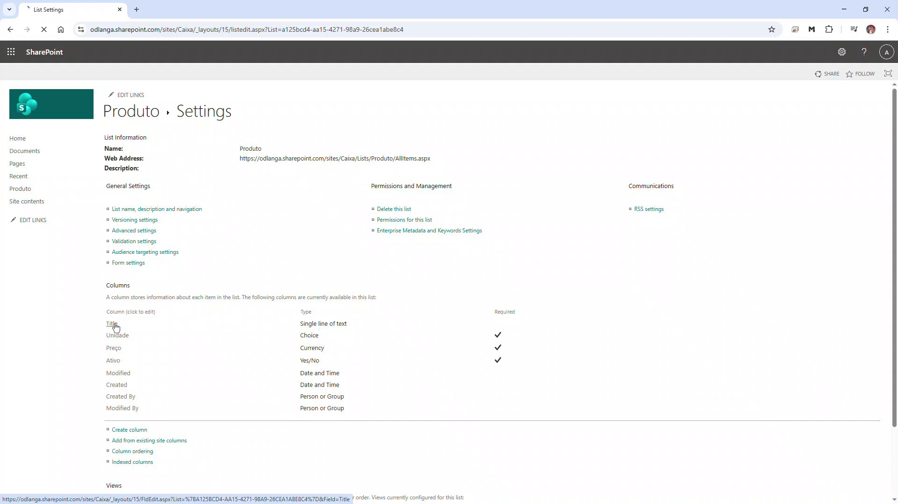

---

## 15. Editar a coluna Title

1. Na seção **Columns**, clique em **Title**.
2. A página **Settings > Edit Column** será aberta.
3. No campo **Column name**, altere o nome da coluna para:

```text
Nome
```

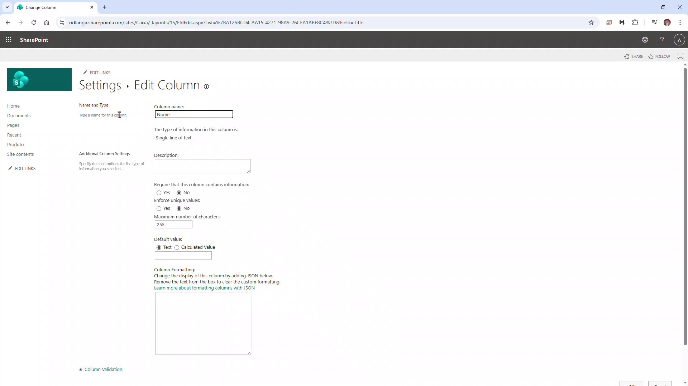

---

## 16. Tornar a coluna Nome obrigatória

1. Na configuração da coluna, localize a opção **Require that this column contains information**.
2. Selecione **Yes**.
3. Mantenha **Enforce unique values** como **No**, salvo se houver exigência de nomes únicos.
4. Role até o final da página e clique em **OK** para salvar.

Após salvar, a página de configurações passa a exibir a coluna **Nome** no lugar de **Title**.

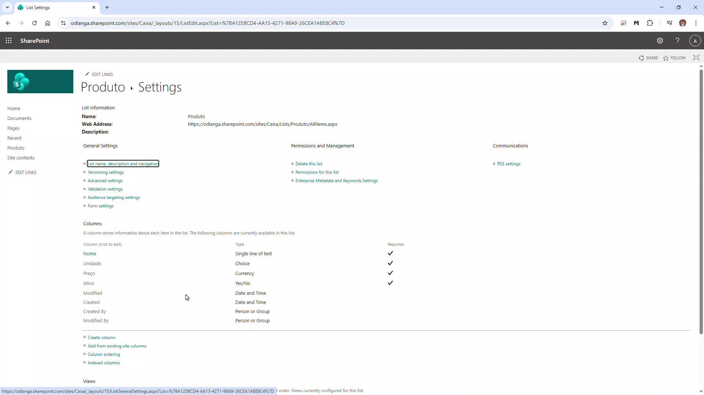

---

## Resultado final

Ao final do processo, a lista **Produto** estará criada no SharePoint com os campos básicos para cadastro de produtos:

- **Nome**: nome do produto.
- **Unidade**: unidade de medida do produto.
- **Preço**: preço do produto com duas casas decimais.
- **Ativo**: indicação se o produto está ativo para uso.

## Observações didáticas

- A coluna **Title** é criada automaticamente pelo SharePoint. Renomeá-la para **Nome** deixa a lista mais coerente com o cadastro de produtos.
- A coluna **Unidade** foi criada como **Choice** para padronizar os valores e evitar digitação inconsistente.
- A coluna **Preço** deve usar **Currency**, e não texto, para permitir ordenação, filtros, cálculos e integração posterior com Power Automate ou Power Apps.
- A coluna **Ativo** facilita ocultar produtos antigos sem excluir o histórico da lista.
