# Passo a passo — Gerar código automático para produtos no SharePoint com Power Automate

Este guia descreve o procedimento demonstrado no vídeo para criar uma coluna **Código** na lista **Produto** do SharePoint e preencher automaticamente esse campo usando um fluxo no Power Automate.

## Objetivo

Criar um código automático no padrão:

```text
PR-00001
PR-00002
PR-00003
```

O código será gerado com base no **ID interno do item** criado no SharePoint.

## Pré-requisitos

- Lista **Produto** criada no SharePoint.
- Colunas já existentes na lista:
  - **Nome**
  - **Unidade**
  - **Preço**
  - **Ativo**
- Acesso ao Power Automate.
- Permissão para criar fluxos e alterar itens da lista.

---

## 1. Acessar a lista Produto

1. Abra o site do SharePoint.
2. Acesse a lista **Produto**.
3. Confirme que a lista contém as colunas principais do cadastro de produtos.

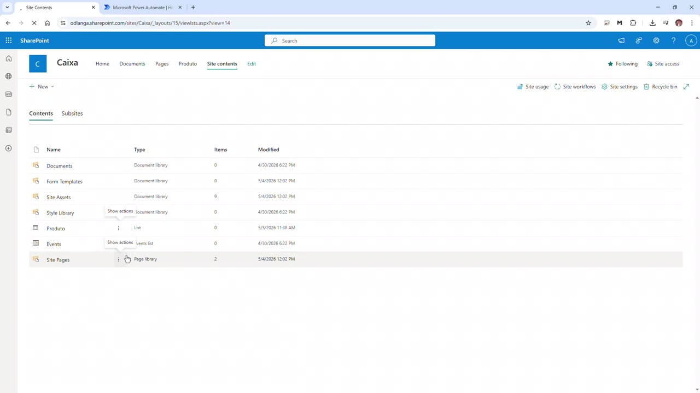

---

## 2. Criar a coluna Código

1. Acesse as configurações da lista.
2. Clique em **Create column**.
3. No campo **Column name**, informe:

```text
Código
```

4. Selecione o tipo:

```text
Single line of text
```

5. Mantenha a coluna como texto, pois o código terá prefixo alfanumérico, como `PR-00001`.
6. Confirme a criação da coluna.

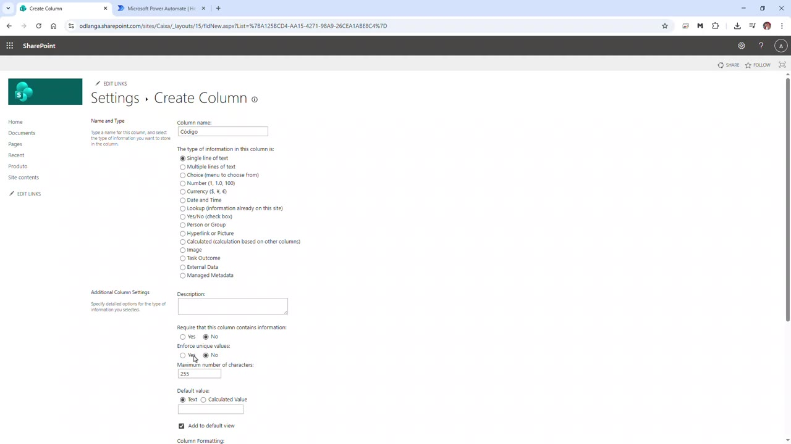

> Observação: não use coluna do tipo número para esse caso. O valor final contém letras, hífen e zeros à esquerda.

---

## 3. Ajustar a ordem das colunas

1. Volte para as configurações da lista.
2. Clique em **Column ordering**.
3. Posicione a coluna **Código** na ordem desejada.
4. No vídeo, a coluna **Código** é posicionada antes das demais colunas principais.
5. Clique em **OK** para salvar.

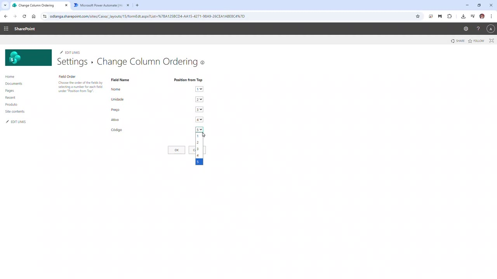

---

## 4. Confirmar a coluna na lista

1. Retorne para a lista **Produto**.
2. Confirme que a coluna **Código** aparece na exibição.
3. Neste momento, a coluna ainda ficará vazia para novos itens, pois o preenchimento automático será feito pelo Power Automate.

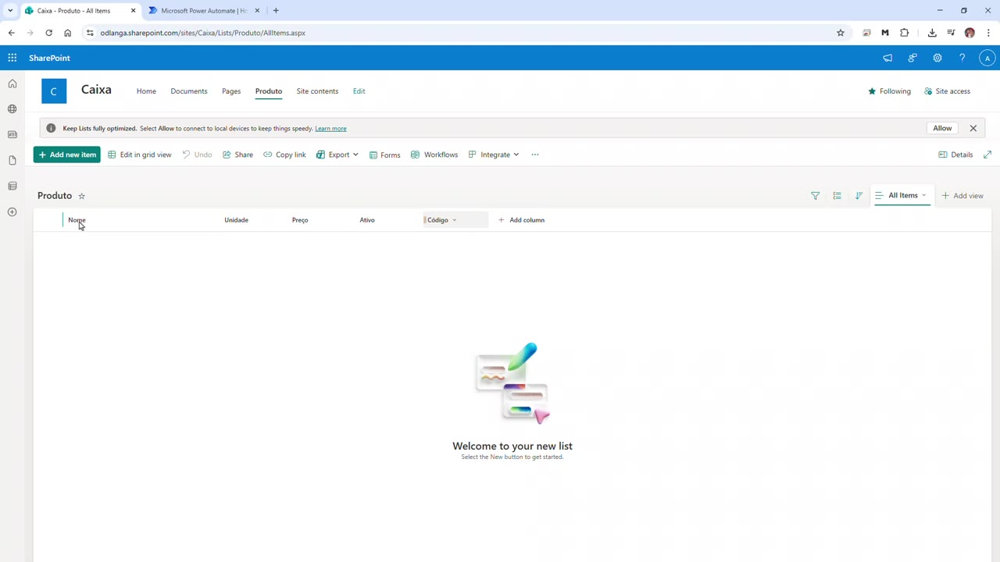

---

## 5. Abrir o Power Automate

1. Acesse o Power Automate.
2. No menu lateral, clique em **My flows**.
3. Confirme que está no ambiente correto.
4. Clique em **New flow** para criar um novo fluxo.

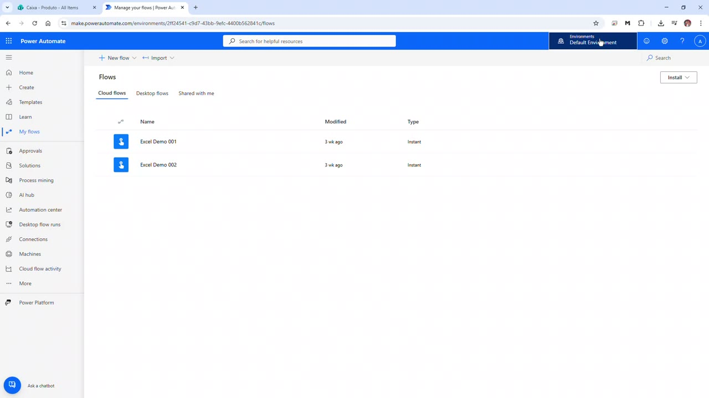

---

## 6. Criar um fluxo automatizado

1. Escolha a opção **Automated cloud flow**.
2. Informe o nome do fluxo.
3. No vídeo, o fluxo é nomeado como:

```text
Criar Produto.Código
```

4. Pesquise e selecione o gatilho do SharePoint:

```text
When an item is created
```

5. Clique em **Create**.

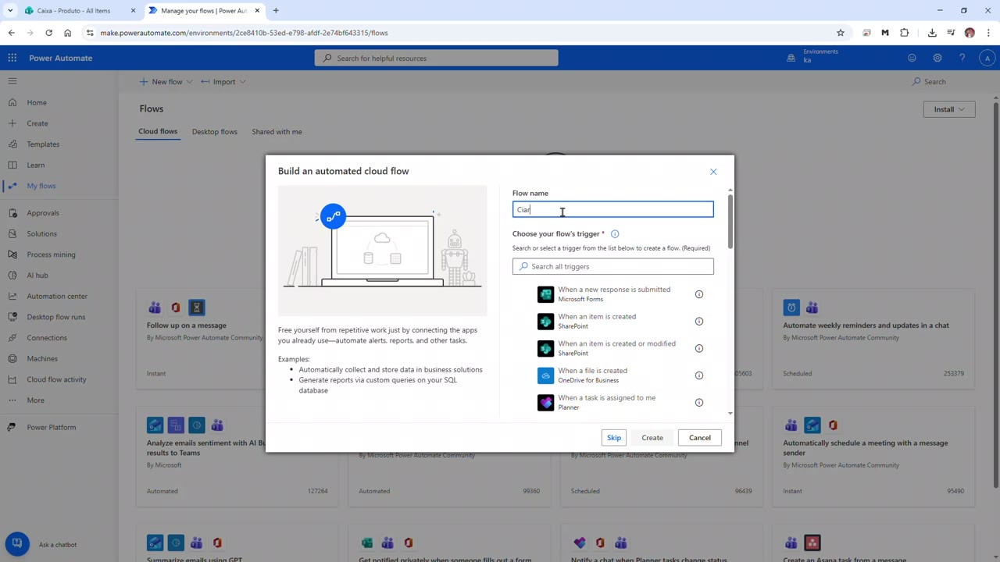

---

## 7. Configurar o gatilho do SharePoint

1. No gatilho **When an item is created**, configure o endereço do site.
2. Em **Site Address**, selecione o site usado no vídeo:

```text
Caixa
```

3. Em **List Name**, selecione:

```text
Produto
```

Esse gatilho será executado sempre que um novo item for criado na lista **Produto**.

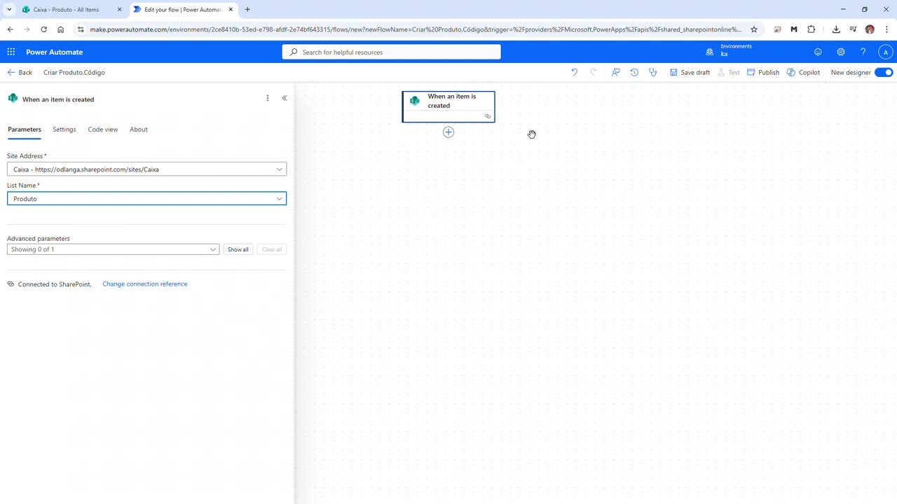

---

## 8. Adicionar a ação Update item

1. Abaixo do gatilho, clique no botão de adicionar nova etapa.
2. Pesquise pela ação do SharePoint:

```text
Update item
```

3. Adicione a ação ao fluxo.
4. Configure o mesmo site e a mesma lista:

```text
Site Address: Caixa
List Name: Produto
```

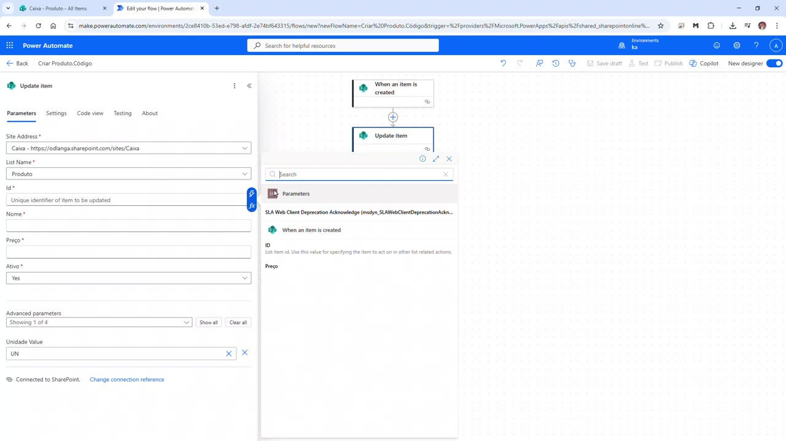

---

## 9. Preencher os campos obrigatórios do Update item

Na ação **Update item**, preencha os campos obrigatórios usando o conteúdo dinâmico vindo do gatilho **When an item is created**.

Use o seguinte mapeamento:

| Campo no Update item | Valor a usar |
|---|---|
| **Id** | **ID** do item criado |
| **Nome** | **Nome** do item criado |
| **Preço** | **Preço** do item criado |
| **Ativo** | **Ativo** do item criado |
| **Unidade Value** | Valor da coluna **Unidade** |

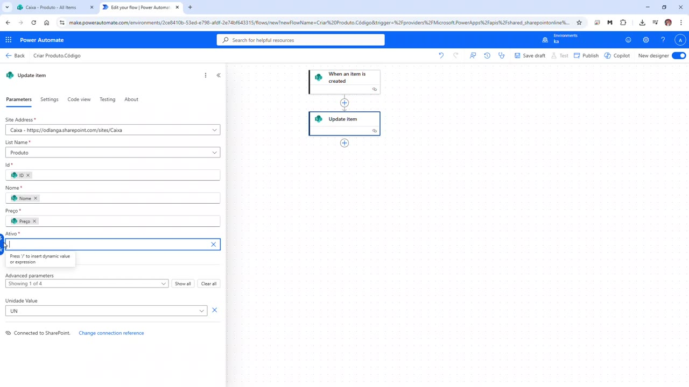

> Ponto importante: o **Update item** exige que os campos obrigatórios sejam reenviados. Se você preencher apenas o campo Código, o fluxo pode falhar ou sobrescrever dados indevidamente.

---

## 10. Inserir a expressão para gerar o Código

1. Localize o campo **Código** na ação **Update item**.
2. Clique no campo.
3. Abra a guia de expressão/função.
4. Insira a expressão que monta o código com prefixo `PR-` e cinco dígitos.

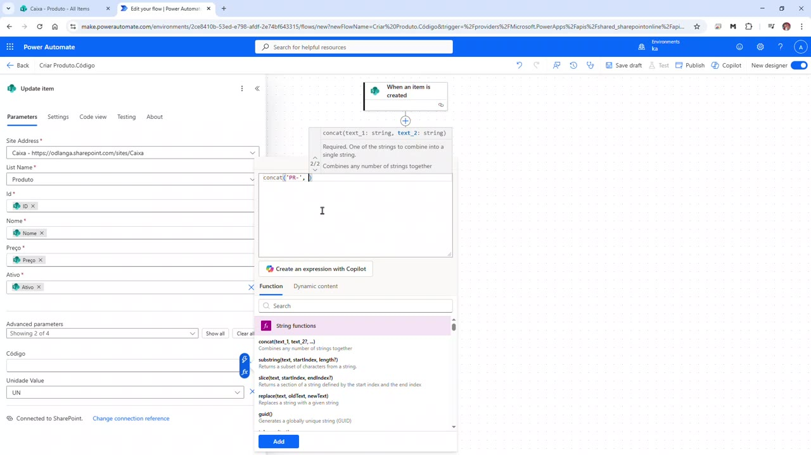

---

## 11. Usar a expressão completa

Use a expressão abaixo no campo **Código**:

```text
concat('PR-', substring(concat('00000', string(triggerBody()?['ID'])), sub(length(concat('00000', string(triggerBody()?['ID']))), 5), 5))
```

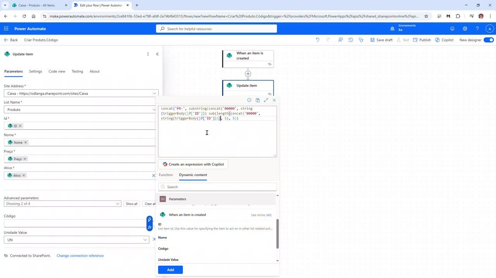

### O que a expressão faz

- `triggerBody()?['ID']` obtém o ID gerado pelo SharePoint.
- `string(...)` converte o ID para texto.
- `concat('00000', ...)` adiciona zeros à esquerda.
- `substring(...)` pega apenas os últimos 5 caracteres.
- `concat('PR-', ...)` adiciona o prefixo do código.

Exemplos:

| ID do SharePoint | Código gerado |
|---:|---|
| 1 | PR-00001 |
| 25 | PR-00025 |
| 132 | PR-00132 |
| 1234 | PR-01234 |

---

## 12. Confirmar a expressão no campo Código

1. Depois de adicionar a expressão, confirme que ela aparece como conteúdo do campo **Código**.
2. Mantenha os demais campos preenchidos com os valores vindos do item criado.
3. Salve o fluxo.
4. Publique o fluxo, se necessário.

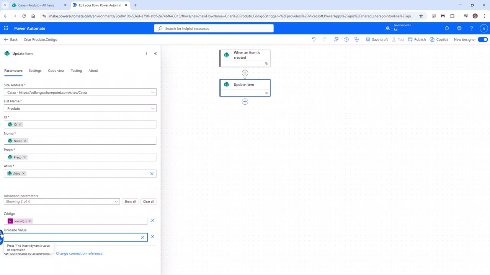

---

## 13. Testar criando um novo produto

1. Volte para a lista **Produto** no SharePoint.
2. Clique em **Add new item**.
3. Preencha os dados do produto.
4. No vídeo, foi preenchido um item semelhante a:

```text
Nome: MARTELO TRAMONTINA
Unidade: UN
Preço: 45.90
Ativo: Yes
```

5. Deixe o campo **Código** em branco.
6. Clique em **Save**.

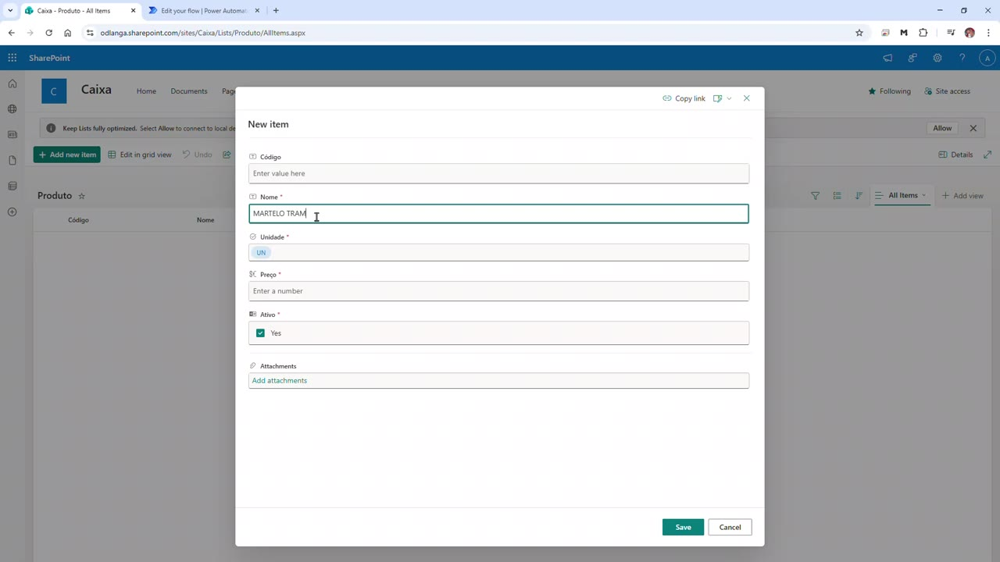

---

## 14. Conferir o código gerado na lista

1. Aguarde alguns segundos para o fluxo executar.
2. Atualize a lista, se necessário.
3. Confirme que o campo **Código** foi preenchido automaticamente.

No vídeo, o item criado recebeu o código:

```text
PR-00003
```

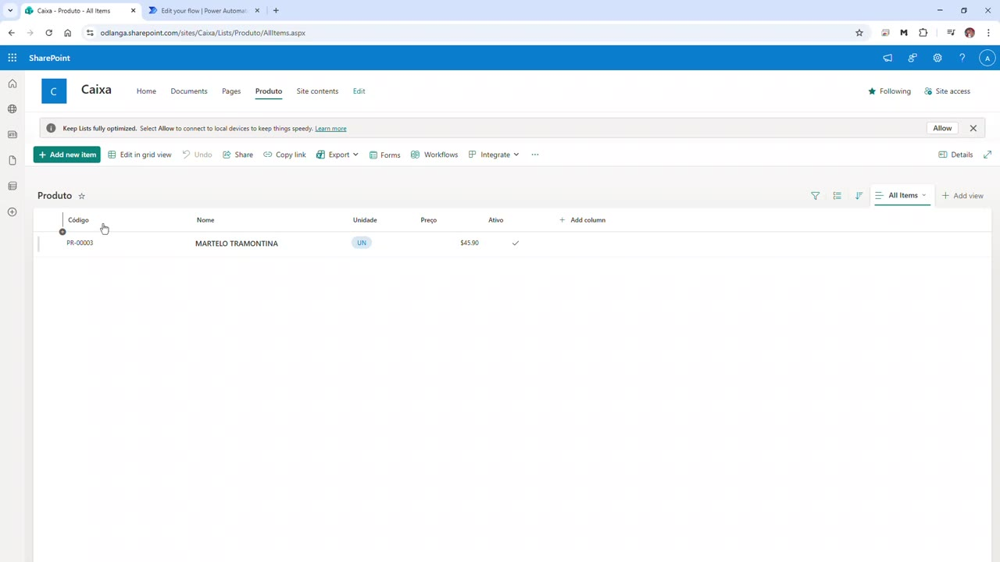

---

## 15. Verificar a execução do fluxo

1. Retorne ao Power Automate.
2. Abra a execução do fluxo.
3. Confirme que o gatilho **When an item is created** foi executado com sucesso.
4. Confirme que a ação **Update item** também foi concluída com sucesso.
5. Nos detalhes da execução, o campo **Código** aparece com o valor gerado.

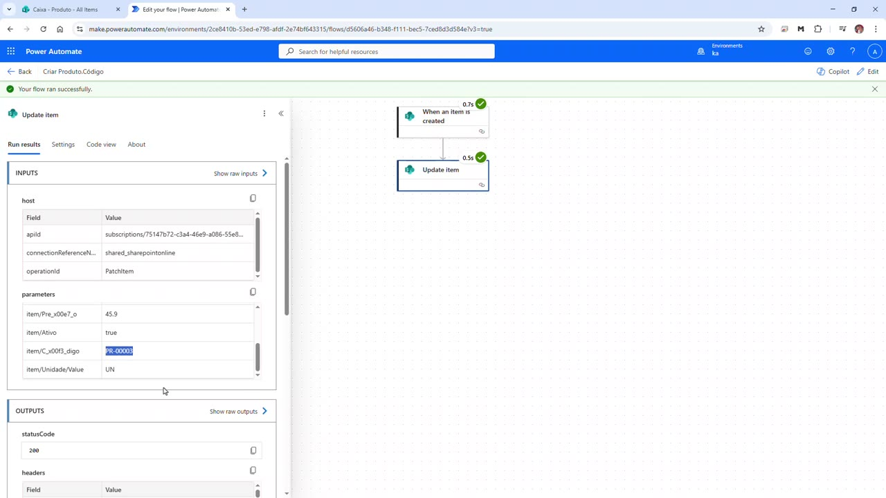

---

## Resultado final

Ao final do procedimento, todo novo item criado na lista **Produto** passa a receber automaticamente um código no formato:

```text
PR-00001
```

Esse código é gravado na coluna **Código** da própria lista.

---

## Observações importantes

- O SharePoint não possui autonumber customizado nativo como o Dataverse.
- O campo **ID** do SharePoint é interno, automático e não pode ser definido manualmente.
- A coluna **Código** deve ser texto.
- O fluxo usa o ID interno apenas como base para montar um identificador mais amigável.
- Como o gatilho é **When an item is created**, a atualização do item não dispara novamente o mesmo fluxo.
